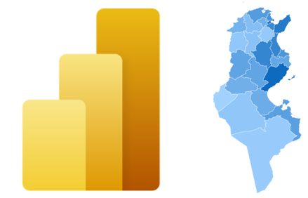

# Power BI : Créer des cartes de formes personnalisées 

---

## Configuration Power BI Desktop : Cartes de formes

---

## Préparation des données

### Données à visualiser

### Donnéess géographiques

---

### Données à visualiser:  Tableau des naissances par gouvernorat en Tunisie

<pre>
    - <b>Identifiant géographique</b> : Gouvernorat 
    - <b>Valeur à visualiser</b> : Nombre de naissance en 2022
</pre>

| Gouvernorat   | Naissance 2022 |
|---------------|---------------|
| Tunis         | 12258         |   
| Ariana        | 7906          |
| Ben Arous     | 8955          |
| Manubah       | 5116          |
| Nabeul        | 10486         |

 ---

## Données géographiques: Gouvernorat en Tunisie

- Format TopoJSON disponible 

- Convertir un fichier GeoJSON 

    - Site mapshaper.org 
    - Logiciel libre QGIS
    - Langages Python ou R

---

# Créer la carte de formes dans Power BI

### Charger les données

### Ajouter la visualisation et lier les données

### Importer le fichier TopoJSON

---

# Créer la carte de formes dans Power BI

### Charger les données

### Ajouter la visualisation et lier les données

### Importer le fichier TopoJSON

---

# Créer la carte de formes dans Power BI

### Charger les données

### Ajouter la visualisation et lier les données

### Importer le fichier TopoJSON

---

# Créer la carte de formes dans Power BI

### Charger les données

### Ajouter la visualisation et lier les données

### Importer le fichier TopoJSON

